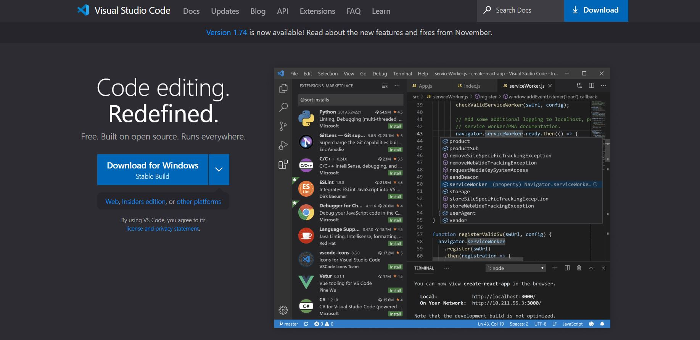

# Visual Studio Code

## VS code clone by using only two technologies:-

### My learning:
- This project helped me understanding flexbox in depth.
- I also learned about grid and its use case to a greater extend.
- While making this project i landed researching on positions in css which is one of the **most** important concepts.
- And, of course i learned about tailwind. I went through the tailwind documentation.
- learned tailwind breakpoints.